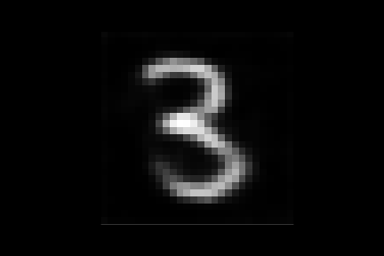
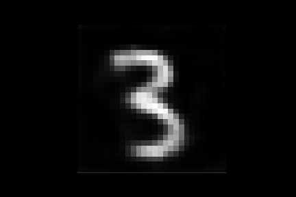
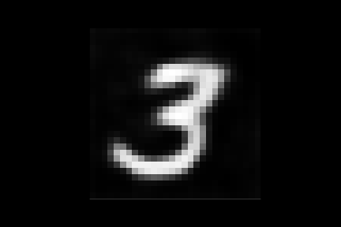
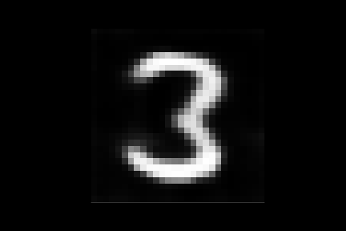

# 

TensorFlow and PyTorch implementation of [Deep generative second order ODEs with Bayesian neural networks](https://arxiv.org/pdf/1905.10994.pdf) by <br/> [Çağatay Yıldız](http://cagatayyildiz.github.io), [Markus Heinonen](https://users.aalto.fi/~heinom10/) and [Harri Lahdesmäki](https://users.ics.aalto.fi/harrila/).

<p align="center">
  
</p>

We tackle the problem of learning low-rank latent representations of possibly high-dimensional sequential data trajectories. Our model extends Variational Auto-Encoders (VAEs) for sequential data with a latent space governed by a continuous-time probabilistic ordinary differential equation (ODE). We propose
1. a powerful second order ODE that allows modelling the latent dynamic ODE state decomposed as position and momentum
2. a deep Bayesian neural network to infer latent dynamics.

## Video
Here is our video summarizing the paper:

[](https://www.youtube.com/watch?v=PscfJTyELbQ)

## Minimal PyTorch Implementation
In addition to the TensorFlow implementation decribed below, we provide a minimal, easy-to-follow PyTorch implementation for clarity. Check [torch_ode2vae_minimal.py](./torch_ode2vae_minimal.py) for more details. The dataset needed to run the script is [here](https://1drv.ms/u/s!AoCg_EHL_pqdhvJXVYVDdL2ww4ibOA). Make sure to update the path or put both files into the same folder.

## Replicating the Experiments
The code is developed and tested on `python3.7` and `TensorFlow 1.13`. [`hickle`](https://pypi.org/project/hickle/) library is also needed to load the datasets. Full list of dependencies:
```
python==3.7
tensorflow==1.13
matplotlib
scipy
hickle==3.4
tensorflow_probability
torch, torchdiffeq # for torch code
```

Training and test scripts are placed in the [`scripts`](./scripts) directory. In order to run reproduce an experiment, run the following command from the project root folder:
```
./scripts/train_bballs.sh
```
Once the optimization is completed, you can see the performance on test set by running
```
./scripts/test_bballs.sh
```

## All Datasets
The datasets can be downloaded from [here](https://1drv.ms/u/s!AoCg_EHL_pqdhd8yEN6X9lMh4ICsPg?e=tqRARi) (1.9 GB). The folders contain
1. preprocessed walking sequences from [CMU mocap library](http://mocap.cs.cmu.edu/)
2. rotating mnist dataset generated using [this implementation](https://github.com/ChaitanyaBaweja/RotNIST)
3. bouncing ball dataset generated using [the code](http://www.cs.utoronto.ca/~ilya/code/2008/RTRBM.tar) provided with the original paper.

Do not forget to update the dataset paths in bash scripts with the local path to the downloaded folder.

## Figures from Trained Models
[This folder](https://1drv.ms/u/s!AoCg_EHL_pqdhdJ-rgX9HBwVSk7MoQ?e=IhORZE) (20 MB) contains TensorFlow graphs of already optimized models. After downloading run
```
./scripts/test_bballs.sh
```
to reproduce the results. Similarly, the path argument in test bash files needs to be overriden by the downloaded checpoint folder path. 

#### Example Walking Sequences
<p align="center">
  
  
  
</p>

#### Rotating Threes
<p float="center">
  
   
   
   
   
   
   
   
</p>

#### Long Term Bouncing Balls Predictions
<p align="center">
  
</p>
